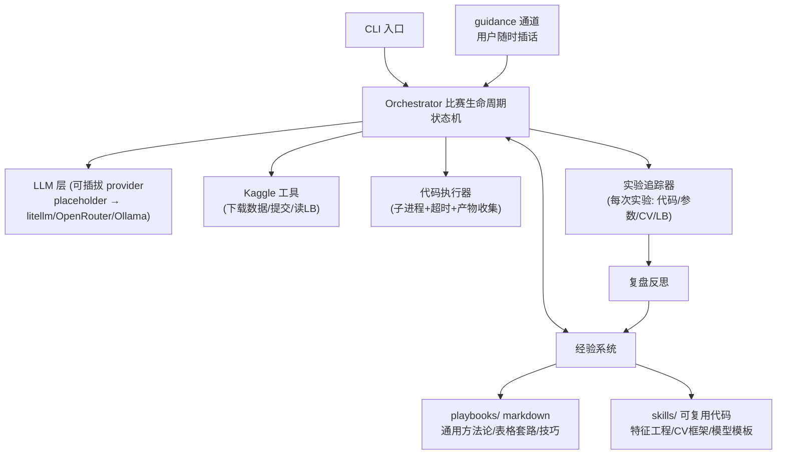
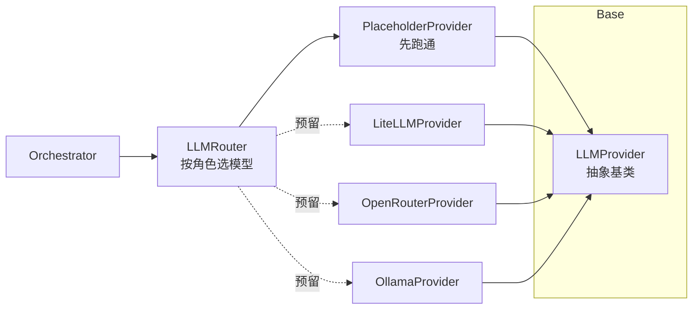
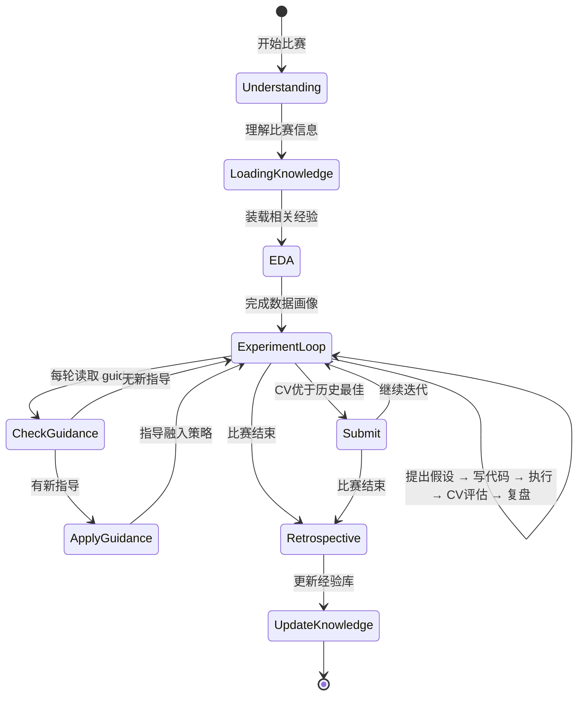

# Kaggle Agent：自进化竞赛代理设计文档

## 1. 目标与愿景

构建一个能自动参加 Kaggle 比赛、从实战中持续积累经验并不断进化的 agent。核心是建立**「尝试 → 反馈 → 沉淀 → 复用」**的正向循环，让 agent 越打越强。

### 核心能力
- **全自动比赛**：从下载数据到提交结果的端到端自动化
- **人工指导注入**：用户可随时插话给建议，指导被采纳后沉淀为经验
- **双层经验系统**：文本 Playbook（战略层）+ 代码技能库（战术层）
- **可插拔 LLM**：支持 OpenRouter、Ollama 等多种 provider

## 2. 已确认决策

| 维度 | 决策 | 备注 |
|------|------|------|
| 运行模式 | C（混合） | 全自动 + 人工随时指导 |
| 比赛类型 | 先表格类 | 架构为多类型扩展留空间 |
| 执行环境 | 本地 | 用 Kaggle API 下载数据、提交 |
| LLM | 可插拔 | 抽象基类 + placeholder 实现 |
| 经验机制 | 1+3 组合 | Playbook 文本 + 代码技能库 |

## 3. 整体架构



## 4. LLM 层架构（可插拔 provider）



### 4.1 抽象基类 `LLMProvider`

```python
from abc import ABC, abstractmethod
from dataclasses import dataclass
from typing import List, Dict, Any, Optional

@dataclass
class ChatMessage:
    role: str  # "system", "user", "assistant"
    content: str

@dataclass
class ChatResponse:
    content: str
    prompt_tokens: int
    completion_tokens: int
    model: str
    cost_usd: float

class LLMProvider(ABC):
    @abstractmethod
    def chat(
        self,
        messages: List[ChatMessage],
        max_tokens: int = 1024,
        temperature: float = 0.7,
    ) -> ChatResponse:
        pass

    @abstractmethod
    def estimate_cost(self, prompt_tokens: int, completion_tokens: int) -> float:
        pass
```

### 4.2 角色路由配置

```yaml
# config.yaml
llm:
  providers:
    - name: "openai"
      type: "placeholder"
      api_key_env: "OPENAI_API_KEY"
      model: "gpt-4o-mini"
      cost_per_1k_prompt: 0.15
      cost_per_1k_completion: 0.60

  roles:
    planner: "openai"      # 决策、策略选择
    coder: "openai"        # 写代码、特征工程
    reviewer: "openai"     # 复盘反思、代码 review
    summarizer: "openai"   # 写文档、总结经验
```

## 5. 比赛生命周期（Orchestrator 状态机）



### 5.1 状态说明

| 状态 | 职责 | 输出 |
|------|------|------|
| Understanding | 读比赛说明、数据字典、评价指标 | `competition_profile.json` |
| LoadingKnowledge | 按比赛特征检索 playbook、选择技能模板 | 上下文装载的经验 |
| EDA | 生成并执行探索代码 | `eda_report.md` + 数据画像 |
| ExperimentLoop | 核心迭代：假设→代码→执行→评估→复盘 | `experiments/` 记录 |
| Submit | 选择最优方案提交、拉取 LB 分数 | 提交记录 + CV-LB 对照 |
| Retrospective | 写复盘、提炼经验 | retrospective.md |
| UpdateKnowledge | 更新 playbook、提炼新技能入库 | 经验库增量更新 |

## 6. 经验系统（进化的核心）

### 6.1 Playbook 文本经验库

```
knowledge/playbooks/
├── general.md          # 通用方法论
├── tabular.md          # 表格类比赛套路
├── cv.md               # CV 类（预留）
├── nlp.md              # NLP 类（预留）
└── techniques/         # 具体技巧卡片
    ├── target-encoding.md
    ├── kfold-stratified.md
    ├── pseudo-labeling.md
    └── ...
```

**技巧卡片格式**：
```markdown
# Target Encoding

## 适用条件
- 高基数类别特征 (>10 categories)
- 数据量足够大 (avoid overfitting)
- 非时间序列（防止 target leakage）

## 用法
```python
from sklearn.base import BaseEstimator, TransformerMixin
# ... code snippet
```

## 实战验证
- competition: house-prices
- date: 2024-01-15
- cv_improvement: +0.002
- lb_improvement: +0.001
- notes: 对 Neighborhood 特征特别有效
```

### 6.2 代码技能库

```
knowledge/skills/
├── __init__.py
├── base.py             # Skill 基类与元数据
├── feature_engineering/
│   ├── __init__.py
│   ├── target_encoding.py
│   └── count_encoding.py
├── cross_validation/
│   ├── __init__.py
│   └── stratified_kfold.py
├── models/
│   ├── __init__.py
│   ├── lgbm_config.yaml
│   └── xgb_config.yaml
└── pipelines/
    └── tabular_baseline.py
```

**技能元数据**：
```python
@dataclass
class SkillMetadata:
    name: str
    description: str
    applicable_types: List[str]  # ["tabular"]
    applicable_conditions: str   # markdown
    inputs: List[str]
    outputs: List[str]
    verified_in: List[str]  # competition slugs
    avg_cv_improvement: Optional[float]
    last_updated: str
```

### 6.3 反思与更新机制

**实验级小反思**（每次实验后）：
- 记录：做了什么、预期 vs 实际结果、关键观察
- 格式：存进 `experiments/exp_001/reflection.md`

**比赛级大反思**（比赛阶段性结束）：
- 复盘：整体策略、哪些尝试有效、失败原因、CV-LB 一致性
- 输出：retrospective.md

**经验落盘**（从 retrospective 更新全局知识库）：
- LLM 起草更新：对比现有 playbook，提出增补/修改
- 规则合并：新技巧验证次数 >=3 才进 playbook；修改现有条目需标注冲突解决
- 代码技能：表现好的实验代码被提炼成技能模块 + 元数据

## 7. 人机交互（C 模式落地）

### 7.1 CLI 命令

```bash
# 开始/继续跑比赛
kagent run <competition-slug> [--resume]

# 插入指导
kagent guide <competition-slug> "试试对 categorical 特征做 target encoding"

# 查看当前状态
kagent status <competition-slug>

# 停止当前比赛（安全退出）
kagent stop <competition-slug>

# 列出历史比赛
kagent list

# 查看某个比赛的复盘
kagent retro <competition-slug>
```

### 7.2 Guidance 通道

```
competitions/<slug>/guidance_queue.json
```

```json
{
  "pending": [
    {"id": "g001", "timestamp": "2025-06-10T14:30:00Z", "content": "试试 LightGBM"}
  ],
  "processed": [
    {"id": "g002", "timestamp": "...", "content": "...", "adopted": true, "reason": "..."}
  ]
}
```

Orchestrator 每轮实验前读取 pending，消费后标记为 processed 并写回。

## 8. 工具层

### 8.1 Kaggle API 封装

```python
class KaggleClient:
    def download_competition(self, slug: str, dest: Path) -> None
    def submit(self, slug: str, file_path: Path, message: str) -> str  # submission_id
    def get_leaderboard(self, slug: str) -> Leaderboard
    def get_my_submissions(self, slug: str) -> List[Submission]
    def download_previous_submission(self, submission_id: str) -> Path
```

### 8.2 代码执行器

```python
@dataclass
class ExecutionResult:
    success: bool
    stdout: str
    stderr: str
    return_code: int
    artifacts: Dict[str, Path]  # 产物路径（模型文件、预测结果等）
    execution_time_sec: float

def execute_code(
    code: str,
    working_dir: Path,
    timeout_sec: int = 300,
    env_vars: Optional[Dict[str, str]] = None,
) -> ExecutionResult:
    """在隔离子进程中执行 Python 代码"""
```

### 8.3 实验追踪器

```
competitions/<slug>/experiments/
├── manifest.json           # 所有实验索引
├── exp_001/
│   ├── code.py            # 完整实验代码
│   ├── config.yaml        # 实验配置
│   ├── reflection.md      # 实验级反思
│   ├── metrics.json       # CV 分数、训练时间
│   └── artifacts/         # 模型、预测文件
└── exp_002/
    └── ...
```

## 9. 安全与成本护栏

### 9.1 预算控制

```yaml
# config.yaml
budget:
  max_experiments_per_competition: 50
  max_llm_cost_usd: 50.0
  max_execution_time_per_exp_sec: 600
  max_submissions_per_day: 5
```

### 9.2 执行安全

- 代码执行在子进程，超时强制终止
- 禁止网络访问（除非白名单 Kaggle API）
- 敏感操作（提交）需要确认或配置 auto_submit: true

### 9.3 CV-LB 监控

- 记录每次实验的 CV 分数与提交后的 LB 分数
- 监控过拟合：CV-LB 差距过大时预警
- 自动选择：提交前必须 CV 优于历史最佳（可配置阈值）

## 10. 项目结构

```
kaggle-agent/
├── pyproject.toml
├── config.yaml
├── README.md
├── src/
│   └── kaggle_agent/
│       ├── __init__.py
│       ├── cli.py                 # CLI 入口
│       ├── config.py              # 配置加载
│       ├── llm/
│       │   ├── __init__.py        # 统一接口 + 角色路由
│       │   ├── base.py            # LLMProvider 抽象基类
│       │   ├── placeholder.py     # placeholder 实现
│       │   └── litellm.py         # litellm 适配器（预留）
│       ├── orchestrator.py        # 生命周期状态机
│       ├── tools/
│       │   ├── __init__.py
│       │   ├── kaggle_api.py      # Kaggle API 封装
│       │   ├── executor.py        # 代码执行器
│       │   └── tracker.py         # 实验追踪器
│       ├── knowledge/
│       │   ├── __init__.py
│       │   ├── playbooks.py       # Playbook 读写检索
│       │   ├── skills.py          # 技能库管理
│       │   └── reflection.py      # 反思与更新机制
│       └── interaction.py         # guidance 通道
├── knowledge/                     # 经验库（git 管理）
│   ├── playbooks/
│   │   ├── general.md
│   │   ├── tabular.md
│   │   └── techniques/
│   └── skills/
│       ├── feature_engineering/
│       ├── cross_validation/
│       ├── models/
│       └── pipelines/
├── competitions/                  # 比赛工作区（数据 .gitignore）
│   └── .gitignore
└── tests/
    ├── unit/
    │   ├── test_llm.py
    │   ├── test_tools.py
    │   └── test_knowledge.py
    └── integration/
        └── test_titanic_smoke.py  # Titanic 端到端冒烟测试
```

## 11. 验证策略

### 11.1 单元测试

- LLM provider 接口契约测试
- Kaggle API mock 测试
- 执行器超时与错误处理测试
- 实验追踪器 CRUD 测试

### 11.2 端到端冒烟测试

**Titanic 比赛完整闭环**：
1. 下载 Titanic 数据
2. 执行 EDA，生成数据画像
3. 跑 3-5 轮实验（每轮：写代码 → 执行 → 评估 CV）
4. 自动提交最优方案（optional，可用 dry-run）
5. 写复盘、更新经验库
6. 验证经验库有增量更新

## 12. 演进路线图

| 阶段 | 目标 | 交付物 |
|------|------|--------|
| MVP | 表格类比赛全自动跑通 | CLI + Orchestrator + 基础经验库 + Titanic 冒烟通过 |
| v0.2 | 经验积累闭环 | 复盘机制 + Playbook/技能库自动更新 |
| v0.3 | 多类型扩展 | CV/NLP playbook + 代码模板 |
| v0.4 | 高级策略 | AutoML 搜索、集成学习自动化 |
| v1.0 | 银牌级水平 | 在常见表格赛稳定进 Top 10% |

---

**文档版本**: 0.1.0  
**最后更新**: 2025-06-10  
**作者**: Claude + 用户协作
